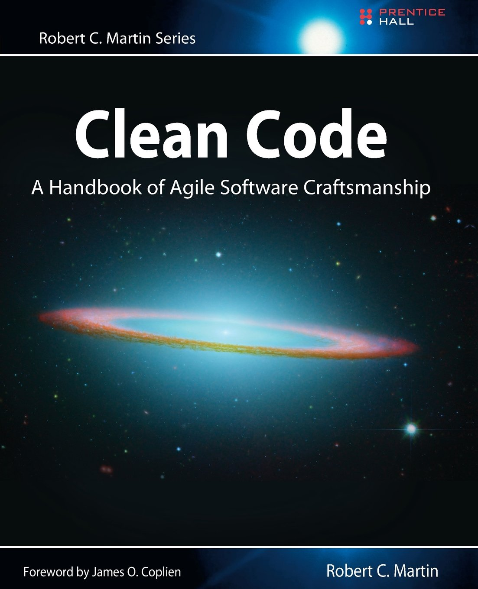

Writing Good Code for Data Processing
===
author: Jack Brookes
date: February 2018
width: 1280
height: 720
font-import: http://fonts.googleapis.com/css?family=Roboto+Condensed|Roboto+Mono
font-family: 'Roboto Condensed'
incremental: true
css: custom.css

What is good code?
===



*** 

- "Efficient"
- "Readable"
- "Maintainable"
- "Unsurprising"
- "Elegant"

Balance of trade-offs

Example: data
===
incremental: false

CSV file: Columns are participant ID, gender, year of birth, and performance in a task


|p     |female |    y|         x|
|:-----|:------|----:|---------:|
|P_001 |TRUE   | 1979| -0.081988|
|P_002 |TRUE   | 1977| 44.039312|
|P_003 |FALSE  | 1983| 40.260712|
|P_004 |FALSE  | 1984| 10.267848|
|P_005 |FALSE  | 1985| 10.475362|
|P_006 |FALSE  | 1989| 16.152712|
|P_007 |TRUE   | 1980| -9.279193|
|P_008 |FALSE  | 1987| 61.813136|
|P_009 |FALSE  | 1983|  8.318062|
|P_010 |FALSE  | 1985|  7.493287|
|P_011 |FALSE  | 1989| 38.966216|
|P_012 |FALSE  | 1995| 29.700951|
|P_013 |TRUE   | 1976| 20.546637|

Example code
===
incremental: false

```r
data <- read_csv("participant_performance.csv")
data =data %>%
  filter(((x-mean(x))/sd(x) < 3) & ((x-mean(x))/sd(x) > -3))
data$a <- as.integer(format(Sys.Date(), "%Y"))-data$y

data2 <- filter(data, female == F)
```


Add Comments?
===
incremental: false


```r
# read data
# columns are:
# p: Participant ID, y: Year of birth, x: Task performance
data <- read_csv("participant_performance.csv") 
# remove if performance z-score > 3 or < -3
data =data %>%
  filter(((x-mean(x))/sd(x) < 3) & ((x-mean(x))/sd(x) > -3))
# calculate (rough) age using current year
data$a <- as.integer(format(Sys.Date(), "%Y"))-data$y

# data with only males
data2 <- filter(data, female == F)
```

Comments
===


***

- Comments can't fix the code
- Comments get left outdated 
- Takes extra time (both reading and writing)
- Think about:
  - What aspect of my code is this comment improving?
  - Can the code be changed to remove the need for a comment?


Naming / Abstraction
===
incremental: false
At the top of our script...

```r
# CONSTANTS

z_cutoff <- 3

current_year <- Sys.Date() %>% 
  format("%Y") %>% 
  as.integer()


# FUNCTIONS

zscore <- function(x){
  (x - mean(x)) / sd(x)
}
```

Naming
===
incremental: false


```r
# READ RAW DATA
perf_data_raw <- read_csv("participant_performance.csv") %>% 
  rename(participantID = p, is_female = female, year_of_birth =y,performance = x) %>%
  mutate(gender = ifelse(is_female, "Female", "Male")) %>% 
  select(-is_female) #remove redundant column

# PREPROCESS
perf_data =perf_data_raw %>%
  filter(abs(performance_z) < z_cutoff) 

perf_data$age <- current_year-perf_data$year_of_birth
perf_Males <- filter(data, gender == "Male")
```
* **P**rinciple **O**f **L**east **A**stonishment
* **D**ont **R**epeat **Y**ourself principle

Consistency & Formatting
===
incremental: false

Keep a consistent style e.g. [Tidyverse style guide](http://style.tidyverse.org/), [Google's R style guide](https://google.github.io/styleguide/Rguide.xml)

```r
# READ RAW DATA
perf_data_raw <- read_csv("participant_performance.csv") %>% 
  rename(participant_id = p,
         is_female = female,
         year_of_birth = y,
         performance = x) %>%
  mutate(gender = ifelse(is_female, "Female", "Male")) %>% 
  select(-is_female) #remove redundant column

# PREPROCESS
perf_data <- perf_data_raw %>%
  mutate(performance_z = zscore(performance)) %>%
  filter(abs(performance_z) < z_cutoff) %>% 
  mutate(age = current_year - year_of_birth)

perf_males <- perf_data %>%
  filter(gender == "Male")
```


Big payoff now our script and data is "tidy"
===
incremental: false


|participant_id | year_of_birth| performance|gender | performance_z| age|
|:--------------|-------------:|-----------:|:------|-------------:|---:|
|P_001          |          1979|   -0.081988|Female |    -1.5250431|  39|
|P_002          |          1977|   44.039312|Female |     1.4652947|  41|
|P_003          |          1983|   40.260712|Male   |     1.2091987|  35|
|P_004          |          1984|   10.267848|Male   |    -0.8235790|  34|
|P_005          |          1985|   10.475362|Male   |    -0.8095147|  33|
|P_006          |          1989|   16.152712|Male   |    -0.4247301|  29|
|P_007          |          1980|   -9.279193|Female |    -2.1483871|  38|
|P_008          |          1987|   61.813136|Male   |     2.6699224|  31|
|P_009          |          1983|    8.318062|Male   |    -0.9557265|  35|
|P_010          |          1985|    7.493287|Male   |    -1.0116260|  33|
|P_011          |          1989|   38.966216|Male   |     1.1214638|  29|
|P_012          |          1995|   29.700951|Male   |     0.4935069|  23|
|P_013          |          1976|   20.546637|Female |    -0.1269302|  42|
|P_014          |          1981|  -18.873198|Female |    -2.7986245|  37|


Programming principles and tips
===
type: sub-section

Abstraction & levels of complexity
=== 

- Human-like description
- Morning routine:
- Don't:
  - Open eyes
  - Move arm 52.8cm towards alarm clock
  - Depress index finger on off button with force of 1.4N
  - Put feet on floor
  - ...


Abstraction & levels of complexity
=== 

- Do:
  - Turn off alarm
  - Put on slippers
  - Brush teeth
  - Make coffee
  - ...


Hide complexity
===

- Break down code into several, abstract steps
  - "Import raw data", "Pre-process", "Create graphs", "Perform statistical tests"
- Hide complexity with user-defined functions
  - `head_pl <- sum((diff(head$x)^2 + diff(head$y)^2 + diff(head$z)^2)^0.5)`
  - `head_pl <- path_length(head)`


Goals of programming
===

- Do not use R (or MATLAB, Python, LabVIEW...) exclusively like a "tool"
- Platform for developing ideal tools
- Imagine yourself as a naive user of these tools


Summary
===

- Code is for humans, not for computers
  - "Any fool can write code that a computer can understand. Good programmers write code that humans can understand." (M. Fowler)
- Comments do not always make better code
- Small amount of extra time early has big payoffs later


Interactive example
===
type: sub-section

- Process & visualise some example data
- RMarkdown
- Tidyverse
  - Suite of packages that share the same underlying philosophy
  - Removes some complexities
  - Human-friendly verbs (e.g. `separate`, `filter`, `gather`)
- "Whole game" https://www.youtube.com/watch?v=go5Au01Jrvs

  
  
